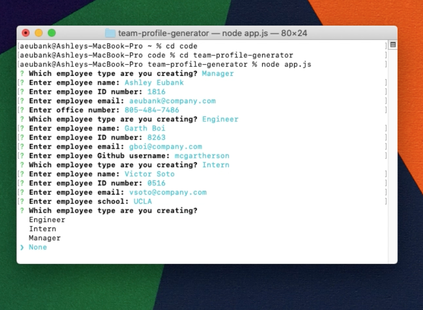
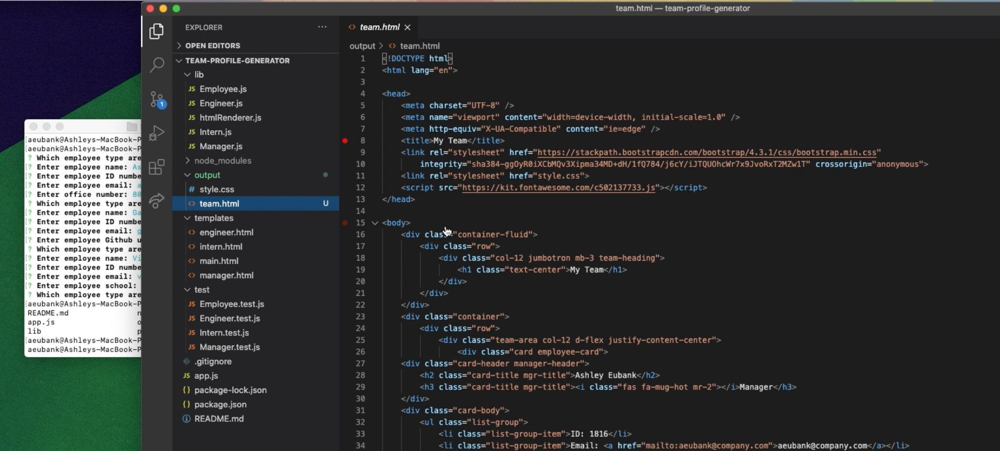
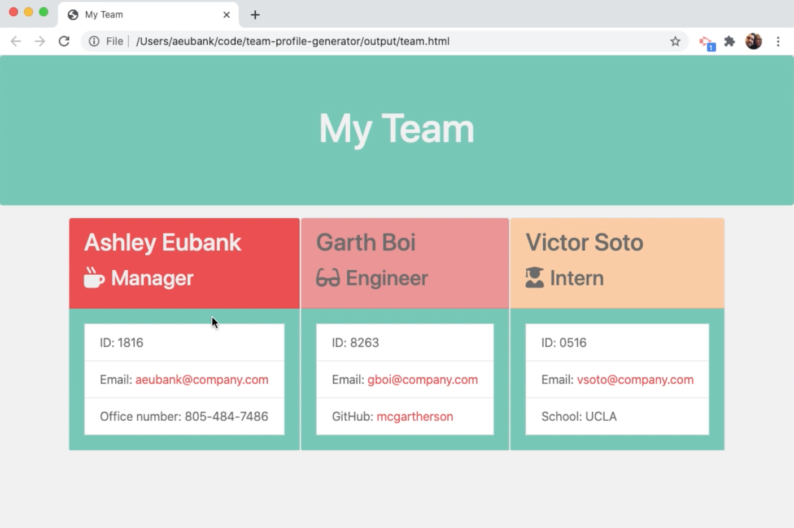

# Team Profile Generator  

## Table of Contents:
* [Description](#Description)
* [Installation](##installation)
* [Usage](##usage)
* [Contribution Guidelines](##contribution)
* [Testing](##test)
* [License](##license)
* [Links](##links)
* [FAQs](##Questions)

## Description:
User can easily create an html page with a list of employees that have different parameters based on their employees class.

## Installation:
Download VS Code

## Usage:
Can be used in external terminal on main machine or inside integrated terminal of VS Code.

## Contribution:
Submit a pull request.

## Test:
By using bash commands the application can be run in the terminal. The user is prompted with a series of questions about individual team members. After all team members information is entered, the user selects "None" and the application ends. A new html file is created with employee data.

## License:
None

## Links:
[Deployed Site/Related Links](https://youtu.be/2Oh3wQhvixQ)

## Questions?
Contact me through Github:
[Git Hub](https://github.com/eubank87)
Or send an email to: eubank.ashley@gmail.com